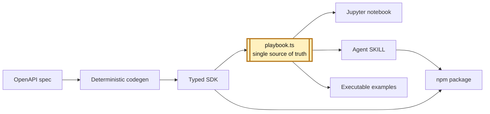

import BlogHeader from '../BlogTitle';
import FeedbackFooter from '../FeedbackFooter';
import Image from 'next/image';
import heroImage from './heroimage.png';
import jupyternbImage from './jupyter-notebook.png';

export const metadata = {
  title: "Beyond Hallucinations: A Playbook-First Agentic OpenAPI SDK Repo",
  description:
    "A short essay on agentic repo design: deterministic OpenAPI codegen, a Jupytext playbook as single source of truth, and one artifact serving many tasks.",
  openGraph: {
    title: "Beyond Hallucinations: A Playbook-First Agentic OpenAPI SDK Repo",
    description:
      "A short essay on agentic repo design: deterministic OpenAPI codegen, a Jupytext playbook as single source of truth, and one artifact serving many tasks.",
    url: "/blog/agentic-openapi-sdk",
    images: [
      {
        url: "/images/agentic-openapi-sdk/thumbnail.png",
        alt: "Beyond Hallucinations: A Playbook-First Agentic OpenAPI SDK Repo",
      },
    ],
  },
  twitter: {
    title: "Beyond Hallucinations: A Playbook-First Agentic OpenAPI SDK Repo",
    images: ["/images/agentic-openapi-sdk/thumbnail.png"],
  }
};

<BlogHeader
  title="Beyond Hallucinations: A Playbook-First Agentic OpenAPI SDK Repo"
  subtitle="One file, many tasks"
  postDate="2026-03-14"
/>

<Image
  src={heroImage}
  alt="Beyond Hallucinations: A Playbook-First Agentic OpenAPI SDK Repo"
  priority
/>

## Introduction

Many so-called agentic SKILLs still ask the model to do the least suitable job in the stack: generate the artifacts. For OpenAPI spec, that is backwards. The spec is already structured, so the deterministic layer should own the contract, while AI should work on interpretation, examples, and guidance.

That is the design I wanted in this repo - [agentic-openapi-sdk](https://github.com/jianliao/agentic-openapi-sdk). The implementation details matter, but the more interesting question is philosophical: what should belong to tools, what should belong to AI, and what should stay reviewable by humans?

## Core Philosophy

1. **Structured work belongs to tools.**  
   OpenAPI is not vague source material waiting for a model to "understand" it. It is already a machine-readable contract. In this repo, `@hey-api/openapi-ts` generates the TypeScript SDK because compilers are better than prompts at preserving structure, types, and edge cases.

2. **Interpretive work belongs to AI.**  
   Once the SDK exists, the problem changes. Now the useful work is summarizing behavior, spotting patterns, writing examples, and turning a raw client surface into something easier for humans and downstream agents to use. That is where AI actually helps.

3. **Human review is still required.**  
   Even when the agent is working on the right layer, generated guidance still needs judgment. Good agentic design is not full automation. It is a workflow where the most important artifacts remain readable, editable, and reviewable by humans.

4. **The best agentic artifact is one file that can survive multiple contexts.**  
   My strongest preference is to avoid scattering truth across prompts, docs, tests, and hidden pipeline glue. If one source can feed several tasks without duplication, the whole system becomes easier to trust.

## Playbook as the Single Source of Truth

That last principle is the real center of the repo. The most important artifact is not the generated SDK. It is `playbook.ts`: a Jupytext-based TypeScript text notebook that becomes the single source of truth for how the SDK should actually be used.

What matters here is not just reuse. It is the kind of reuse. The same file can serve as human-readable documentation, executable examples, notebook review source, and exported Markdown skill content. That is a much cleaner agentic design than generating a pile of disconnected artifacts and hoping they stay in sync.

## What Jupytext Unlocks

Jupytext is the enabling idea behind this design. Because the playbook is authored as a text notebook, Jupyter Notebook can render the same TypeScript source in a visual notebook workflow instead of forcing review to happen only through raw code or CI logs. That makes human intervention much more natural.

<Image
  src={jupyternbImage}
  alt="Jupyter Notebook Rendering of the Playbook"
  priority
/>

The same decision also creates downstream distribution benefits. Since the playbook is still source text, it can be exported to Markdown and shipped together with the typed SDK as skill-style guidance for agents. In other words, notebook review and dual-asset npm packaging are not separate tricks. They are both consequences of treating one Jupytext-based file as the center of the system.

## Conclusion

The point of this repo is not that AI can generate more code. The point is that an agentic system becomes stronger when tools, AI, and humans each do the part they are best at. Deterministic tooling owns the contract. AI owns the interpretive layer. Humans own judgment. And the whole workflow becomes easier to trust when one playbook can move across all of those contexts without losing its identity.

## Related Links

- [Repository](https://github.com/jianliao/agentic-openapi-sdk) and [README.md](https://github.com/jianliao/agentic-openapi-sdk/blob/main/README.md)
- [Playbook Example](https://github.com/jianliao/agentic-openapi-sdk/blob/main/packages/petstore/petstore-playbook.ts)

<FeedbackFooter />
